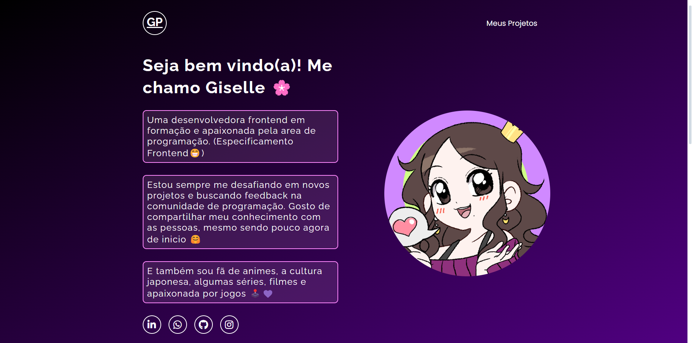

# portifolio-simplificado-dev-em-dobro
<h3>Voce pode ter acesso ao portifólio clicando no link 📎</h3>

https://giselleprecegueiro.github.io/portifolio-simplificado-dev-em-dobro/

# 🌸 Imagem parte do projeto

Uma parte que quis acescentar no projeto, são as bordas separando o parágrafo de minha paresentação. E também a borda em volta do "Meus Projetos" dando um destaque de "quebra" de linha 💜 

# 🖥️ Linguagem utilizadas no projeto
- HTML
- CSS
- JS

<h3>🧠 O projeto foi feito pelos irmãos "Dev em dobro" em 3 lives na platafortma do YouTube.</h3>
